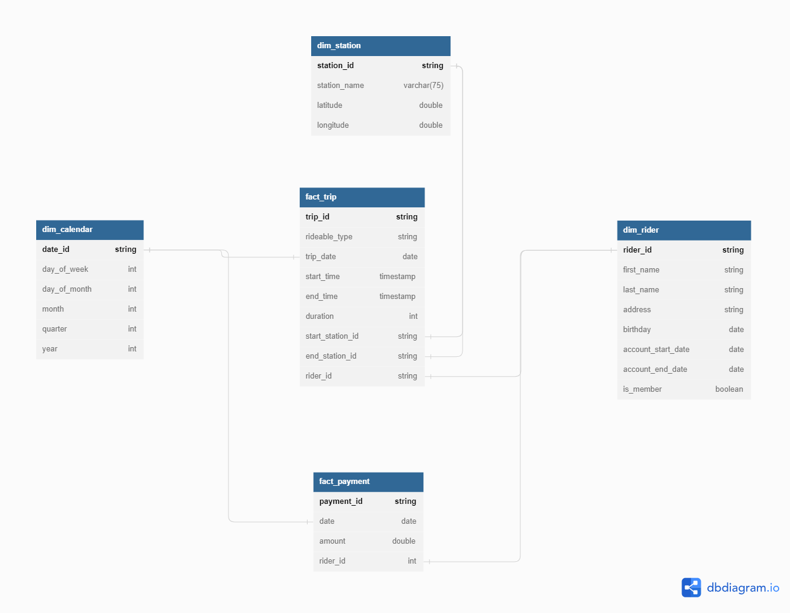

# Building An Azure Data Lakehouse for Bike Share Data Analytics

## Project Overview
Divvy is a bike sharing program in Chicago, Illinois USA that allows riders to purchase a pass at a kiosk or use a mobile application to unlock a bike at stations around the city and use the bike for a specified amount of time. The bikes can be returned to the same station or to another station. The City of Chicago makes the anonymized bike trip data publicly available for projects like this where we can analyze the data.

Since the data from Divvy are anonymous, fake rider and account profiles along with fake payment data to go along with the data from Divvy have been generated. The dataset looks like this:

### Business Requirements
1. Analyze the duration of each ride:
    - Based on date and time factors such as day of the week and time of day
    - Based on the starting and/or ending station
    - Based on the rider's age at the time of the ride
    - Based on whether the rider is a member or casual rider
2. Analyze the cost:
    - Per month, quarter, and year
    - Per member, based on the rider's age at account start
3. Analyze the cost per member:
    - Based on the number of rides the rider averages per month
    - Based on the number of minutes the rider spends on a bike per month

## Technology Stack
- Azure Databricks
- Azure Data Lake Storage Gen2
- Azure Key Vault
- Azure Active Directory
- Azure Storage Explorer

## Solution Architecture

### Dataflow
1. Transfer on-premises raw files to the landing zone container inside Azure Data Lake Storage Gen2 using Azure Storage Explorer.
2. Ingest and process the raw data with Azure Databricks.
3. Use a medallion architecture for storage that organizes data into layers:
    - Bronze: Holds raw data with ingestion time in Parquet.
    - Silver: Contains cleaned and filtered data in Delta.
    - Gold: Stores aggregated data that is useful for business analytics in Delta.
4. Analyse business requirements using Azure Databricks SQL Analytics.
5. For data governance: 
    - Azure AD application to enable Azure Databricks to access Azure Data Lake via Service Principal. 
    - Azure Key Vault to securely manage secrets, keys, and certificates.

## STAR Schema Design - Gold layer
The STAR schema consists of two fact tables (Fact Trip and Fact Payment) and three dimension tables (Dim Calendar, Dim Rider, Dim Station). 

[Star Schema &mdash; PDF](https://github.com/fabiansum/bike-share-analytics-data-lakehouse/blob/main/pdf/star_schema_fabian.pdf)

### References:
- [Modern analytics architecture with Azure Databricks](https://learn.microsoft.com/en-us/azure/architecture/solution-ideas/articles/azure-databricks-modern-analytics-architecture)
- [Data Lake Medallion Architecture Overview](https://www.mssqltips.com/sqlservertip/7689/data-lake-medallion-architecture-to-maintain-data-integrity/)
